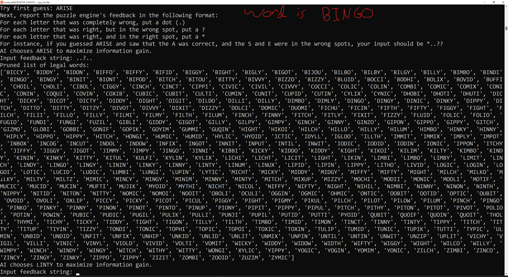
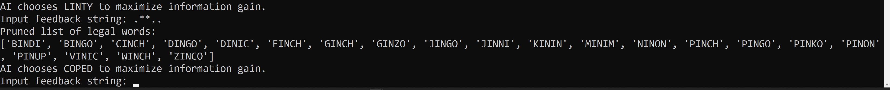
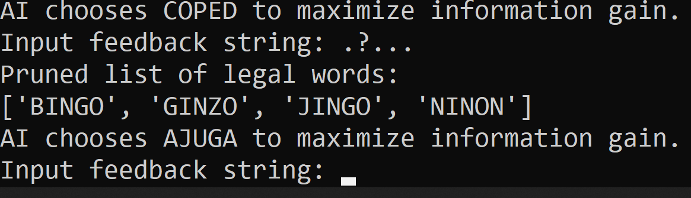
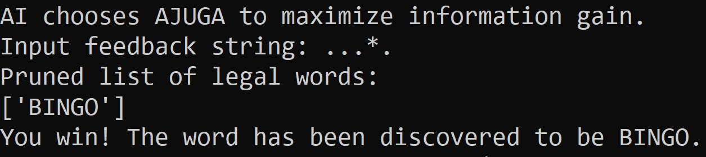

# wordle_ai
A minimal python implementation of minimax to solve Wordle puzzles

## Screenshots
I've arbitrarily selected the word "BINGO" as the hidden word here.

## Background
The game [Wordle](https://www.powerlanguage.co.uk/wordle/) (a hybrid between Hangman and Mastermind) has been making the rounds with many of my puzzle-nut friends lately, and as a fun-sucking computer scientist, I (obviously) wanted to write a program to beat it. Wordle has seen some huge growth and coverage (see the NYT article about it!) and as a fan of word games, I jumped in with relish.

In the game, players are presented with a blank slate of six guesses to uncover a hidden five letter English word. It's up to you how you use these guesses, although you are restricted to guessing words that are in the word list of the game (which, as far as I can tell, isn't public anywhere). I've got a Scrabble Dictionary text file with a fuck load of words in it; I've pruned it down to the five letter words (all 12,292 of them).

Each time you guess a word, the game gives you Feedback (capitalization intended, this is a key concept for understanding the solver and so I've decided to Proper Noun that word). The Feedback tells you, for each letter you guess, one of three possible conditions:
a) the guessed letter is in the hidden word in the correct position
b) the guessed letter is in the hidden word, but out of position
c) the guessed letter is not in the hidden word.

This is slightly different from Mastermind, where the game tells you *how many pegs* are correct or out of position. Wordle's a bit easier: *each letter* carries its own positional information. After playing a few days as a regular human brain guy, it's clear that the optimal strategy is to make early tradeoffs in favor of exploration over exploitation - even if you get the first few letters lucky/correct, it's generally smart to choose your second or third word to gain as much information as possible rather than capitalize on early correct letters. In general, this is a good strategy, but the issue, of course, is quantifying "how much information do I get by playing this word now?" This is the key insight to understanding how the program finds solutions quickly: the goal at each stage is to find the word that will rule out the most potential answers.

Algorithmically, here's the rough plotline: we're going to keep track of a list of valid words given the information we have so far. This list starts as the entire 12,292 word collection. As we learn new information, we remove words from this valid word list. At each step of the way, we'll compute our Best Guess for the current word list based on some minimax search. Then, we'll ask the engine for Feedback on our Best Guess, and with that feedback perform a pruning step. The premise here is to make each pruning step as large as possible.

Let's quickly define a shorthand for understanding the Feedback step.
Assign the character "." to represent a letter is not present in the final word. Next, assign the character "?" to represent a letter that is in the hidden word, but not in the right spot. Finally, assign the character "*" to represent a letter that is both in the hidden word, and in the correct spot.
Next, we'll build a function called Feedback(guess, hidden_word) that returns Feedback strings of the form [.*?]{5}. For example, if you guessed ARISE and the hidden word was FROGS, your Feedback string would be ".*.?." because the A isn't present in FROGS, the R is present in FROGS and in the right spot, the I isn't present in FROGS, the S is present in FROGS but in the wrong spot, and the E isn't present in FROGS.
You can count the number of potential feedback strings for each pair of words with a straightforward combinatorial argument: in our case, all of the words are the same length (5 letters), so the number of potential Feedback strings is 3 ^ 5 = 243, which conveniently will all fit in one byte (256).
To save time later during the Minimax search step, we precompute the Feedback for each (guess, hidden_word) pair and store them in a table on disk. This will be a 12,292 x 12,292 table with each Feedback entry taking one byte to store (nice property of length-five words!) I've gone ahead and done that already - see the feedback_pairs.npy file in the repository.
An aside: we use a neat string encoding trick here. Rather than store the full Feedback string in the feedback_pairs table, we convert the string to a base-3 integer (assign 0 to '.', 1 to '?', and 2 to '*') - it's easy to convert back and forth between the integer representation and the string representation, but using the integer representation saves a decent amount of space.
After running the Best Guess function over the entire word list, it comes up with ARISE (or, more exotically, SERAI) as the best starting word to maximize your information gain. 
This makes gut-check sense to me - it gets three vowels as well as the two most common consonants in play immediately.

## Setup and Execution
You need numpy installed because I'm lazy.
To start, generate the feedback_pairs.npy file with

    $ python precompute.py

To actually run the solver, execute

    $ python solver.py

and follow the instructions. The first word is optimally "ARISE", so try that out in the text field.

